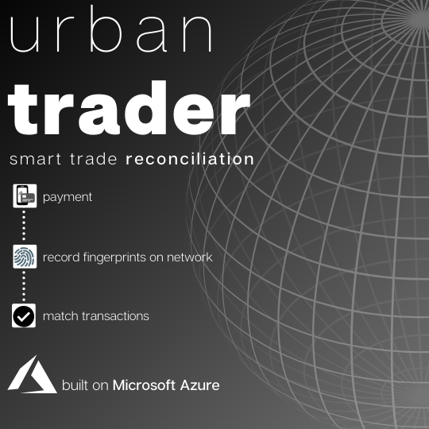
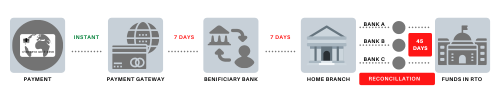
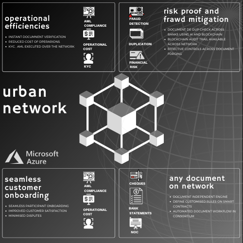

# Urban Trader
 

Blockchain based trade reconciliation platform
==============================================

## Abstract

Urban trader is a platform based on blockchain network hosted on Azure Cloud services and Azure blockchain network. It uses the distributed network to run a parallel blockchain nodes along with the general solutions of payment, trade and reconciliation. The main aim of the project is to reduce/eliminate the manual efforts in book matching which happens after all the parties reconcile the trades. This platform can be used by banks, individuals and authorities who acquire funds. It can be used to expedite the process of reconciliation which can in turn speed up the process for which the funds were acquired.

## The Problem ?

Scenario of a back office trade settlements during t+2 and t+4 kinds of trades, which eventually turns out to be t+45 trade because of poor reconciliation mechanism.

Let’s assume a simple trade scenario where a person “Bob” is trying to pay his road taxes after he upgrades his vehicle to a brand new SUV. He has many options to pay the amount. Either by cash which is very unlikely or using credit card or using a mobile payment gateway. Assume Bob uses his HDFC credit card to make the payment to the Department of Road and Transport. In this transaction - main parties are involved.

* HDFC Bank - When Bob initiates a transaction the initiator bank updates its data base about the credit and processes it to further stage.
The payment gateway - The gateway in between authorises and sends it further.
* RTO’s Subscribed Bank - When the payment information reaches to RTO’s bank , assume SBI, it updates it book saying amount is credited and subject to clearance. Once this gets approved it goes to next step.
* RTO’s Home Branch - While the transaction get’s approved by the subscribed bank of RTO the amount reaches the home branch. This is where all the deposited amount of public resides.

All these 4 steps require minimum of 14-21 days to actually reflect in the account as statements and at the end when the trade is over all the involved banks sends their log files to each other to match the amount.

## What does it mean by match the amount ?

When the amount finally reaches to the destination and assuming thousands of this kind of transaction happened in the due course of that time, the bank authorities have the next challenge of matching the transactions. This happens either manually or using some softwares which are 30 years old. Apart from this since multiple banks are involved and each of them don’t trust each other, they wait for the submissions of the logs of transactions. This process is called “Book Keeping” or “Trade Reconciliation” in larger settlements.

*This manual process takes around 45 days to actually happen. This means each trade “t” is 45 days behind off its settlement date. The repercussions of this can be - *

Temporary debt between parties.
Untimely Settlements.
Un-usual disputes and unnecessary chaos.
Pause in development which includes funds.
Another problem of this is transparency. The trades and funds are not transparent enough in today’s scenario. The fund management needs to be really quick and transparent.

## The Solution

Using Urban Trader, it is trying to solve the problem of reducing the trade settlement duration of ~45 days to minutes using blockchain and distributed ledger technology.

The blockchain network runs in parallel to the normal payments and bank transfers keeping the fingerprints of the transactions recorded in the blockchain network. As and when the transaction signatures and fingerprints gets written the consensus mechanism simplifies the equation of settlements and finally when the amount reaches the beneficiary it is automatically reconciled in the network.

Four features of Urban Trader -

1. Urban Network - This is a solution based on the blockchain technology to build a solution to an old problem of document exchange, book keeping, verification and compliance between heterogeneous banks. This is a pyramid of trust between the customer, issuing bank and the beneficiary bank plus all the involved banking intermediaries. This service is used to efficiently and securely onboard a customer to the Urban Trader platform. This service also support integrations such as wide varieties smart contracts using the micro service based backend of Azure Cloud.

2. Urban Chain - This service is the heart of the Urban Trader platform which aims at the core functionality of this application which is essentially blockchain based reconciliation. Urban chain is an inter-organisation solution which helps organisations reconcile financial and non-financial transactions and records in real time through a trust based network. Urban Chain can be deployed on-premise as well as on cloud. The core uses Azure.

3. Urban Tokens - This is a marketplace for tokens to retain the customers for future. The tokens
can be earned while you onboard to the platform and redeem it for multiple purposes such as waiver of transaction fees. This service is more inclined towards persisting customers on the
platform. The value of the token is based on the sales and network performance.

4. Urban Visibility - Inspired by the needs of a transparent system this service is used to track transactions, track funds and maintain an off chain records for in house funds. The power of blockchain produces efficient sourcing mechanism, utilising transparent supplier selection process, end to end handling of contracts using smart contracts features, purchase requisition to orders done automatically without any manual dependency or interference and seamless in voice to payment processing.

## Architecture and Azure Services used in the project

The complete system is deployed on Azure Cloud. This uses these main features of Azure.

* Azure Blockchain Service
* Azure DevOps
* Azure Compute
* Azure Kubernetes Services ( Containers)
* Azure Cosmos DB
* Azure SQL
* Azure Functions
* Azure Active Directory
* The project uses both centralised and de-centralises services from Azure. For the centralised services model based micro service architecture is chosen.

Centralised services common to all the features of Urban Trader.

* Identity Microservice - This micro service is used create an account with a particular role and scope. This uses Azure 
Active directory service for * Identity Access Management. The wrappers of this micro service is written in GoLang and deployed as a MS in Azure Compute Engine managed using the Devops portal.
* CI-CD Pipeline - Each of the services in Urban Trader uses Azure Devops pipeline to create builds and release it. Each of the service is liable to go through the CI test cases and compliance checks which are written inside it.
* Project Planning and Bug Tracking - Azure Devops tool is used for this.
* Container Management - AKS is used for this.

### Author
Rahul Gorai
gorai.rahul@yahoo.co.in

